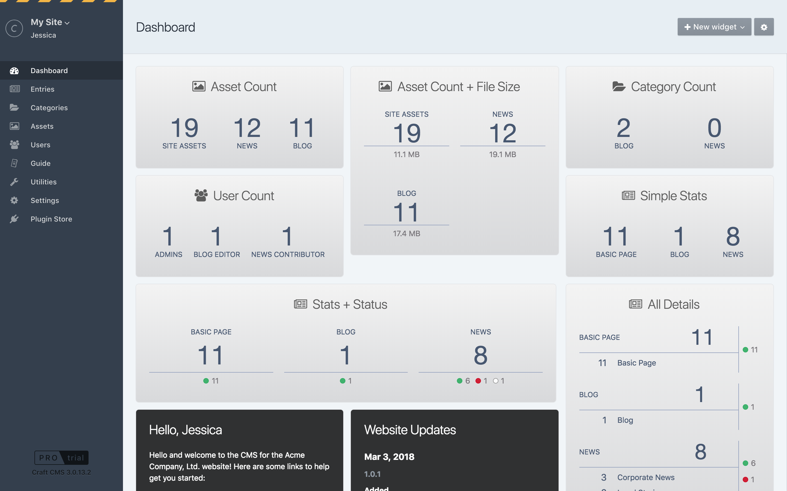
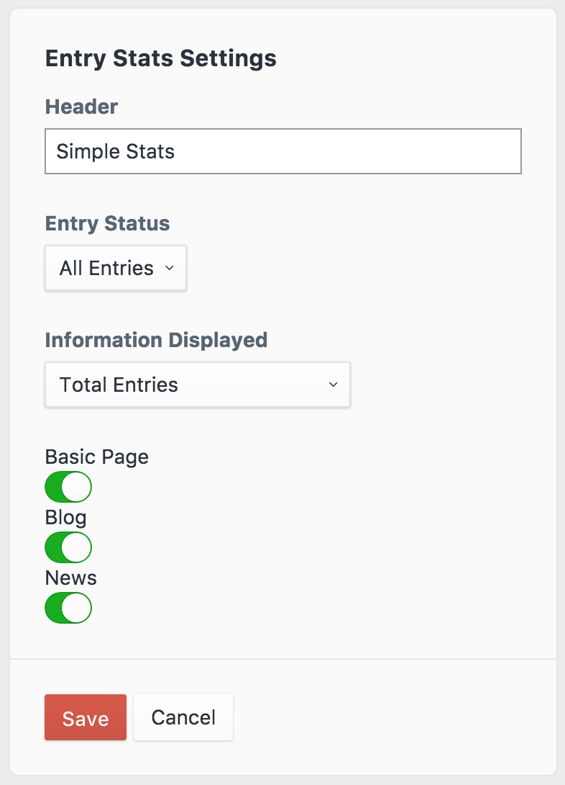

# Content Stats plugin for Craft CMS 3.x

See how many entries, assets, categories, and users are in your Craft CMS website.

## Requirements

This plugin requires Craft CMS 3.0.12 or later.

## Installation

To install the plugin, you can find it in the [Craft Plugin Store](https://plugins.craftcms.com/content-stats), or follow these instructions.

1. Open your terminal and go to your Craft project:

        cd /path/to/project

2. Then tell Composer to load the plugin:

        composer require wbrowar/contentstats

3. In the Control Panel, go to Settings → Plugins and click the “Install” button for Content Stats.

4. Go to the Dashboard page and click "+ New Widget", select "Entry Stats", and configure the display to your liking.

Brought to you by [Will Browar](http://wbrowar.com)
